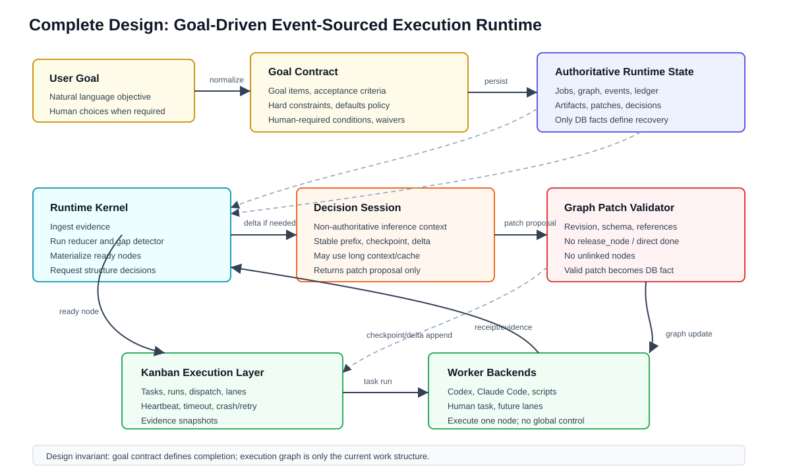
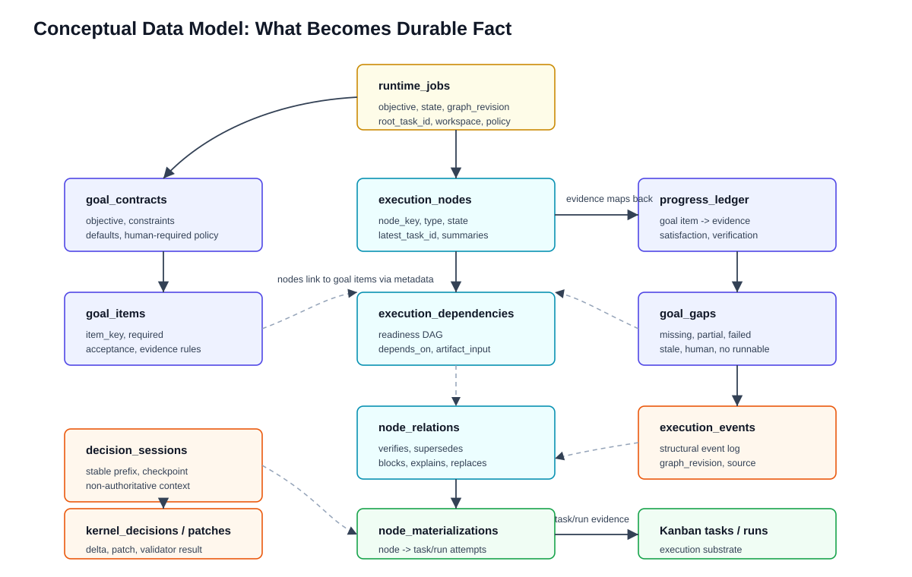
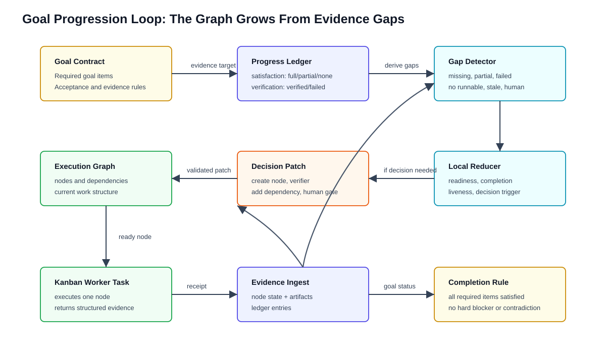
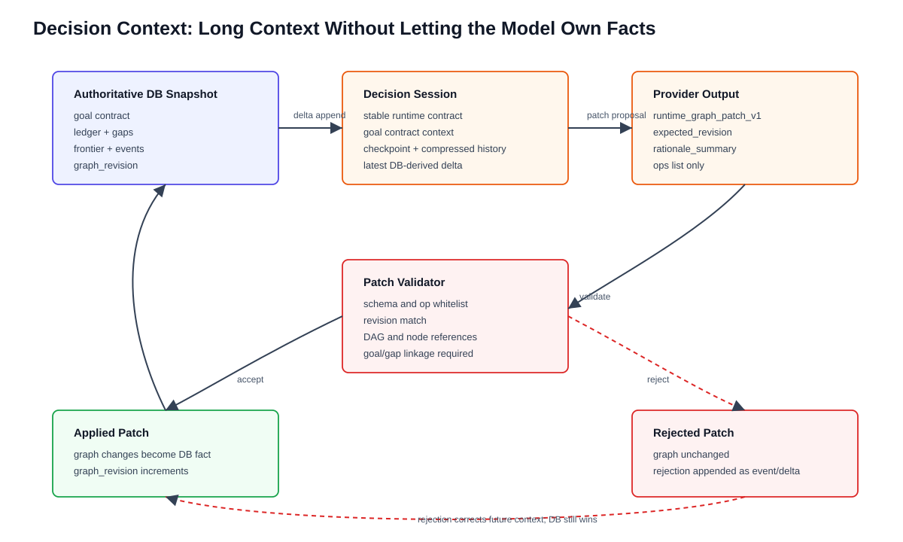
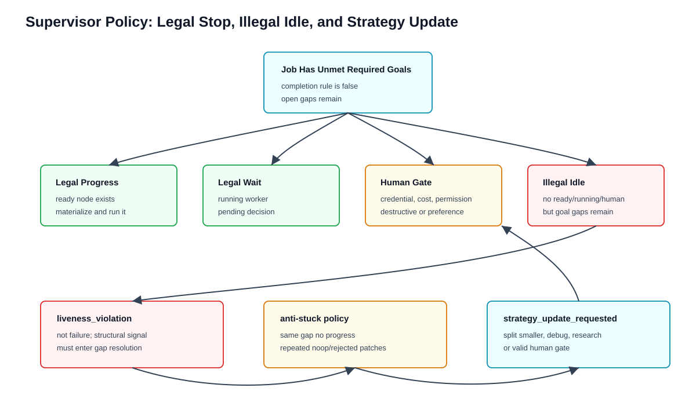

# Hermes Kanban Runtime Kernel 图解完整设计

本文档是 `docs/kanban-runtime-kernel-design.md` 的图文版说明，描述目标架构本身，而不是某个阶段已经落地的实现清单。它把 runtime kernel 设计压成几个工程对象和几条闭环：目标合同、证据账本、执行图、事件流、决策上下文、patch validator、Kanban 执行层，以及 liveness/anti-stuck/human gate policy。

如果只看一句话：这个系统是一个 **goal-driven event-sourced execution runtime**。系统连续性存在于 DB 事实中；execution graph 是为满足 goal contract 临时长出来的工作结构；decision session 只负责推理连续性，不拥有事实；worker backend 只执行单个 node，不参与全局调度。

## 1. 完整分层架构



完整设计不是“一个负责人 agent + 多个 worker agent”。真正长期存在的系统实体是 runtime kernel 和数据库状态。LLM 或 decision provider 只是被 kernel 在必要时调用的一次结构决策函数。

从上到下看：

`User Goal` 是用户自然语言目标。它不是直接变成 execution graph，而是先被规范成 goal contract。

`Goal Contract` 是系统对用户目标的结构化承诺。它描述哪些 goal item 必须被满足，验收标准是什么，哪些硬约束不能破坏，哪些普通工程选择可以默认推进，哪些情况必须请求用户。

`Authoritative Runtime State` 是唯一事实源。所有 job、goal item、ledger、graph、event、artifact、decision、patch 都必须能从 DB 重建出来。

`Runtime Kernel` 是本地调度逻辑。它负责 ingest worker evidence、运行 reducer、检测 goal gaps、判断 liveness、物化 ready node、调用 decision provider，以及应用或拒绝 graph patch。

`Decision Session` 是非权威推理上下文。它可以保留稳定前缀、checkpoint、已排除路径、validator 拒绝历史和最近 delta，以便真实 LLM 后续能利用长上下文和前缀缓存。但 session 里的记忆不能覆盖 DB 事实。

`Graph Patch Validator` 是安全边界。provider 只能提出 patch proposal；validator 检查 revision、schema、引用、DAG、goal linkage 和禁止 op。只有通过 validator 的 patch 才能成为 DB fact。

`Kanban Execution Layer` 负责真实 task/run 生命周期，包括 dispatcher、worker lanes、heartbeat、timeout、crash/retry、evidence snapshot。runtime kernel 不直接管理 worker 进程。

`Worker Backends` 可以是 Codex、Claude Code、本地脚本、人工作业或未来任意 lane。worker 只绑定一个 execution node，接收局部上下文，返回结构化 evidence。

这个分层的关键边界是：**Kanban 是执行系统，runtime kernel 是目标驱动图运行时，decision session 是非权威推理上下文，worker backend 是可替换执行单元。**

## 2. 数据模型：什么东西会成为事实



这个设计最重要的不是 prompt，而是状态结构。每个长期任务都必须能从 DB 恢复，因此系统必须把“事实”和“推理上下文”拆开。

`runtime_jobs` 是任务容器，保存 objective、state、workspace、graph revision、root task 等。job 本身不定义完成条件。

`goal_contracts` 和 `goal_items` 定义完成标准。goal item 是可被 evidence 支持的目标条款，例如“有可运行入口”“核心功能实现”“验证命令通过”“用户说明存在”“不使用付费 API”。

`execution_nodes` 是当前工作结构。node 可以是 analysis、implementation、verification、debug、research、human_gate 等，但这些只是能力需求或执行意图，不是生命周期 phase。

`execution_dependencies` 是调度依赖 DAG，只有这张关系参与 readiness 计算。比如 implementation 必须等 analysis 完成，verification 必须等 implementation 完成。

`node_relations` 是解释性关系，例如 verifies、supersedes、blocks、explains。它们用于审计、dashboard、completion 解释，但不能被误当成 readiness 依赖。

`node_materializations` 记录 execution node 到 Kanban task/run 的每次物化。一个 node 可以因为 retry、rerun、换 lane 或 worker crash 后重跑而有多次 materialization。

`progress_ledger` 是目标证据账本。worker 完成 node 后，系统不只保存 node succeeded，而是把 evidence 映射到 goal item：满足程度是什么、是否已验证、证据引用在哪里、还有什么缺口。

`goal_gaps` 是当前目标缺口视图。gap 可以来自 missing evidence、partial evidence、needs verification、verification failed、contradiction、human gate、no runnable graph 或 stagnation。

`execution_events` 是结构性事件流。它不是 worker 全量日志，而是 kernel 关心的事实演化，例如 node_completed、progress_ledger_updated、goal_gap_detected、decision_requested、patch_rejected、liveness_violation。

`decision_sessions`、`kernel_decisions`、`graph_patches` 和 `decision_checkpoints` 记录模型决策路径。即使 patch 被拒绝，也要保留 delta、provider output、validator result 和 rejection reason，用于审计和纠正后续 decision context。

这个数据模型的核心关系是：**goal contract 定义目标，progress ledger 证明目标，goal gaps 暴露差距，execution graph 承载当前工作，events 记录演化，patches 记录结构变更。**

## 3. 目标推进闭环



runtime 的主循环不是“agent 持续思考”，而是“事件产生、事实更新、本地 reducer 推导、必要时生成结构决策”的闭环。

第一步，用户目标被规范成 goal contract。这个 contract 不等于 plan，它只是完成条件和约束集合。

第二步，execution graph 生成当前工作结构。初始图可以很小，例如只有一个 understand-scope node。复杂结构不是一次性规划出来，而是在执行中根据 gap 逐步长出来。

第三步，ready node 被物化为 Kanban task。worker 执行后返回 receipt/evidence。worker 不和其他 worker 通信，也不参与全局调度。

第四步，kernel ingest evidence，把 node state、artifact refs、assumptions、failure boundaries、verification result 和 goal claims 写入 DB。

第五步，progress ledger 把 evidence 映射到 goal item。比如 mock provider 可能满足“存在数据源抽象”，但不满足“真实行情接入”；单测通过可能满足“provider 行为可验证”，但不满足“端到端回测验证”。

第六步，gap detector 从 goal contract 和 progress ledger 推导剩余 gap。只要 required goal item 没有足够 evidence，job 就不能 done。

第七步，local reducer 判断下一步是否能本地推进。如果已有 verifier node 依赖满足，它直接 ready；如果有 running worker，就等待；如果有合法 human gate，就等待用户；如果无路可走但目标未完成，就进入 decision_requested。

第八步，decision provider 基于 session 和 delta 提出 graph patch。patch 可以创建 implementation/debug/research/verifier/human_gate node，或者调整 dependency，但不能直接 release node，也不能直接 complete job。

这个闭环的关键是：**推进动力来自 goal gaps，而不是来自某个 agent 在长上下文里提醒自己继续。**

## 4. Goal Contract

goal contract 是整个系统的最高层对象。它要回答的是：“用户目标怎样才算被证据满足？”

一个 contract 至少包含：

- `goal_items`：可验证条款。
- `constraints`：执行中不可破坏的硬约束。
- `defaults_policy`：普通工程选择如何默认推进。
- `human_required_conditions`：哪些情况必须请求用户。
- `completion_policy`：job done 的本地判定规则。
- `waivers`：用户明确放弃或降级的条款。

以“实现股票回测系统”为例，goal items 可能是：

- `runnable-entrypoint`：存在可运行入口。
- `market-data-provider`：存在数据 provider 抽象。
- `strategy-execution`：能执行策略逻辑。
- `backtest-result-output`：能输出收益、回撤等结果。
- `verification-command`：有验证命令且通过。
- `usage-doc`：有用户可读说明。

其中 `market-data-provider` 还可以拆成 mock provider 和真实 provider。是否必须接真实行情源取决于 user goal 和 human/default policy；如果需要 API key，则应进入 human gate，而不是让 worker 硬猜凭证。

goal contract 不是一次性 plan。它不规定“先 analysis、再 implementation、再 verification”。它只规定完成条件。execution graph 是为了满足这些条件而动态演化出来的工作结构。

## 5. Progress Ledger

progress ledger 是目标证据账本。它解决的问题是：worker 完成了一个 node，不代表用户目标完成了；必须知道这个结果支持了哪个 goal item，支持程度如何，是否经过验证。

一个 ledger entry 应表达：

- 关联哪个 `goal_item_key`。
- 来源 node、artifact、verifier 或 external tool。
- `satisfaction`：none、partial、full、waived、contradicted。
- `verification_state`：unverified、self_reported、verified、failed_verification、needs_human。
- evidence summary。
- confidence 或 evidence strength。
- remaining gaps。
- active assumptions、rejected approaches、known failure boundaries。

例子：worker 完成 mock provider：

```json
{
  "goal_item_key": "market-data-provider",
  "satisfaction": "partial",
  "verification_state": "self_reported",
  "summary": "mock provider exists, but real market API is not wired",
  "remaining_gaps": ["real provider credentials", "contract tests"]
}
```

这个 evidence 可以让系统知道“数据源抽象部分满足”，但不能让整个系统 done。

例子：verifier 运行 provider contract tests：

```json
{
  "goal_item_key": "market-data-provider",
  "satisfaction": "full",
  "verification_state": "verified",
  "summary": "provider contract tests passed"
}
```

这时对应 goal item 才可能进入 satisfied。completion rule 仍然要检查其他 required items、hard constraints、active human gates 和 contradicted entries。

## 6. Goal Gap Detector

goal gap detector 是持续推进能力的核心。它不依赖 LLM 判断“是否完成”，而是由本地 reducer 从 DB 事实推导。

常见 gap 类型包括：

- `missing_evidence`：required item 没有 evidence。
- `partial_satisfaction` 或 `partial_evidence`：只有部分 evidence。
- `unverified_evidence` 或 `needs_verification`：有实现证据但缺验证。
- `failed_verifier` 或 `verification_failed`：验证失败。
- `blocked_constraint`：硬约束阻塞。
- `human_required` 或 `blocked_by_human_gate`：需要合法用户输入。
- `no_runnable_graph` 或 `no_runnable_for_open_goal`：目标未完成但当前图没有可运行节点。
- `stalled_progress` 或 `stale_or_no_progress`：同一 gap 多轮没有新增证据。

gap detector 的输出不是直接 plan，而是一个结构化问题列表。decision provider 的职责是为这些 gap 提出 graph patch。

例子：如果 `verification-command` 没有 verified evidence，但 implementation node 已经 succeeded，gap detector 生成 `needs_verification`。provider 可以提出 `insert_verifier` patch。

例子：如果 implementation node failed，且没有替代 debug/research node，gap detector 生成 `failed_required_node`。provider 可以提出 debug node 或 split node。

例子：如果所有节点都 succeeded，但 progress ledger 没有满足 usage-doc，gap detector 仍会生成 missing evidence。系统不能因为 graph 跑完就 done。

## 7. Decision Context 和 Patch Validator



完整设计里，decision session 不是负责人 agent，也不是事实源。它是受 DB 约束的长期推理上下文。

每次需要结构决策时，kernel 从 DB 构造 delta：

- 新 terminal node。
- 新 artifact。
- ledger 更新。
- open goal gaps。
- graph frontier。
- validator rejection。
- liveness 或 anti-stuck signal。
- 当前 graph revision。

这个 delta 追加到 decision session。session 前面有稳定 runtime contract、goal contract、checkpoint 和历史压缩状态。这样真实 LLM 不需要每次冷启动理解项目，也可以利用 provider 的前缀缓存。

provider 输出只能是 graph patch：

```json
{
  "schema": "runtime_graph_patch_v1",
  "expected_revision": 7,
  "rationale_summary": "provider tests are missing for market-data-provider",
  "ops": [
    {
      "op": "insert_verifier",
      "target_node_key": "implement-provider",
      "verifier_node_key": "verify-provider-contract",
      "title": "Verify provider contract",
      "goal_item_keys": ["market-data-provider"],
      "gap_keys": ["market-data-provider:needs_verification"]
    }
  ]
}
```

validator 必须拒绝：

- schema 不对。
- `expected_revision` 过期。
- unknown op。
- `release_node`。
- 直接 `complete_job`。
- 无 goal/gap/human linkage 的 node。
- 会造成 dependency cycle 的 patch。
- 引用不存在 node_key 或 goal_item_key。
- 试图越权修改 terminal fact。
- 无合法 reason 的 human gate 或 blocked proposal。

如果 patch 被拒绝，DB graph 不变。拒绝原因进入 `graph_patches`、`kernel_decisions` 和 `execution_events`，并追加回 decision session，纠正后续模型上下文。

## 8. Liveness、Anti-Stuck 和 Human Gate



长期任务需要一个明确的 liveness invariant：

只要 job 未完成且未处于合法等待状态，就必须存在可推进状态：ready node、running node、pending decision、pending graph patch 或合法 human gate。

如果 goal gaps 仍然存在，但没有 ready/running/human/pending decision，系统不能 idle。它必须记录 `liveness_violation`，并触发 gap resolution。

合法停止或等待状态包括：

- `done`：completion rule 满足。
- `waiting_worker`：有 running node。
- `waiting_human`：存在合法 human gate。
- `waiting_decision`：需要 provider patch，或 provider call 正在进行。
- `budget_paused`：达到预算但可恢复。
- `blocked`：本地规则确认存在不可默认推进的外部阻塞。

非法 idle 的典型情况：

- goal contract 仍有 required gap。
- graph 没有 ready/running node。
- 没有 active human gate。
- 没有 pending decision。
- job 也未 done。

这时 `liveness_violation` 不是失败，而是 runtime 发现自身当前 graph 不足以推进目标。

anti-stuck policy 处理另一类问题：系统一直在继续，但没有有效进展。可检测状态包括：

- 同一 gap 多轮没有新增 full/verified ledger evidence。
- 同类节点连续失败。
- provider 连续产生 noop 或 rejected patch。
- worker 多次 uncertain。
- active milestone 超预算但没有满足任何 required item。

触发 anti-stuck 后，系统不应继续相同 retry。它应强制 strategy update，例如拆小任务、换 lane、插入 research/debug、降级 milestone、请求用户选择或改变实现路径。

human gate 是受控阻塞，只能用于真正需要用户授权或偏好的场景：

- 缺少 secret、token、SSH key、API key。
- 需要外部付费资源。
- 需要更高权限。
- 可能做破坏性迁移或删除用户数据。
- 多个高影响产品/架构方向都合理，默认策略无法选择。
- 合规、许可或政策边界。

普通工程选择不应该频繁问用户。目录结构、函数命名、先 mock 后真实接入、局部 debug 路线，都应按 defaults policy 推进并记录 rationale。

## 9. Execution Graph 不是 Phase Machine

设计里允许 node type，例如：

- `analysis`
- `implementation`
- `verification`
- `review`
- `debug`
- `research`
- `human_gate`
- `artifact_transform`

但 node type 只是执行意图，不是 phase。kernel 不允许根据 node type 自动推导固定下一阶段。`analysis -> implementation -> verification` 只能作为测试 fixture，用来证明闭环，不是默认工作流模板。

真正决定顺序的是：

- `execution_dependencies`。
- goal gaps。
- local reducer。
- provider patch。
- validator。
- human/default policy。

一个任务可以先 research，再 human gate，再 implementation；也可以直接 implementation，再 verification；也可以多个 implementation 并行，然后 join 到 verifier。系统不预设角色协作关系，只维护图结构和证据。

## 10. Worker Receipt Contract

worker 不需要知道完整全局目标，但必须知道自己服务哪个 goal gap。worker context 应包含：

- runtime job id。
- execution node id / node key。
- node title / description。
- related goal item keys。
- related gap keys。
- dependency output summaries。
- constraints。
- expected receipt schema。

worker receipt 应尽量返回：

- `verdict`。
- `summary`。
- `claimed_goal_items`。
- `partial_goal_items`。
- `unmet_goal_items`。
- `contradicted_goal_items`。
- `verification`。
- `artifacts`。
- `remaining_gaps`。
- `new_constraints`。
- `active_assumptions`。
- `rejected_approaches`。
- `known_failure_boundaries`。
- `open_questions`。
- `risk_notes`。

这些不是推理链保存，而是把不可丢的执行事实压缩成结构化状态，供 progress ledger、gap detector 和 decision session 使用。

## 11. 示例：股票回测系统

用户目标：“实现一个股票回测系统，可以用数据 provider 输入行情，运行策略，输出回测结果，并有验证命令。”

goal contract 可能生成这些 required items：

- `runnable-entrypoint`
- `market-data-provider`
- `strategy-execution`
- `backtest-result-output`
- `verification-command`
- `usage-doc`

初始图只有 `understand-scope`。worker 返回 evidence：建议先 mock provider，真实行情源需要 API key。

ledger 更新：

- `market-data-provider`: partial/self_reported。
- `verification-command`: none/unverified。
- 新 constraint: real market data requires API key。

gap detector 生成：

- `market-data-provider:partial_evidence`
- `verification-command:missing_evidence`
- `runtime:no_runnable_for_open_goal`

decision provider 提出 patch：

- create `implement-mock-provider`
- create `implement-backtest-engine`
- insert `verify-provider-contract`

mock provider 完成后，backtest engine worker 失败，因为它假设字段名是 `price`，provider 输出是 `close`。

ledger 和 events 记录：

- `strategy-execution`: none/unverified。
- known failure boundary: provider schema mismatch。
- node_failed: implement-backtest-engine。

gap detector 生成：

- `strategy-execution:failed_required_node`
- `provider-contract:needs_verification`

decision provider 这时不需要重新规划整个股票系统。它可以基于 decision session 中的连续上下文提出 `align-provider-backtest-interface` debug node，再插入 verifier。DB 仍然是事实源；如果 provider 基于旧上下文引用了 superseded node，validator 会拒绝 stale patch。

## 12. 完成语义

job done 只能由本地 completion rule 判定。完整设计的完成条件是：

- required goal items 都有足够 ledger evidence。
- required verifier/review nodes 成功，或 goal item evidence requirement 允许无需 verifier。
- 没有 unresolved hard constraint。
- 没有 active human gate。
- 没有 failed required verifier。
- 没有 running required node。
- 没有 contradicted ledger entry。
- 没有未处理的 required gap。

LLM 可以建议 complete，但 validator 必须基于同一套本地规则接受或拒绝。worker 说“完成了”也不够，必须有 ledger evidence。

## 13. 设计分界线

这个 runtime 和普通多 agent 系统的区别不是“用了更多 agent”，而是：

- 连续性在 DB，不在对话上下文。
- completion 由 goal contract 和 progress ledger 判断，不由 graph 是否跑完判断。
- 调度主权在 reducer，不在 LLM。
- LLM 只提 patch，不能直接改事实。
- worker 不互相通信，它们通过 graph dependency 和 artifacts 间接协作。
- human gate 是受控阻塞，不是“不确定就问用户”。
- anti-stuck 是本地可检测 policy，不是让 agent 无限 retry。

如果这些边界成立，复杂任务就不是一次性规划完成，而是在执行过程中基于证据和 gap 持续重构，直到 goal contract 被证据满足，或遇到合法的人类/外部阻塞。
