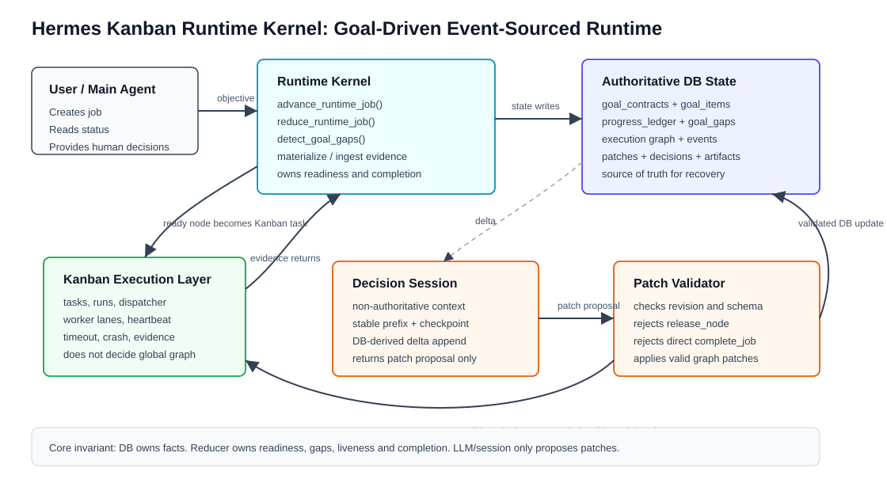
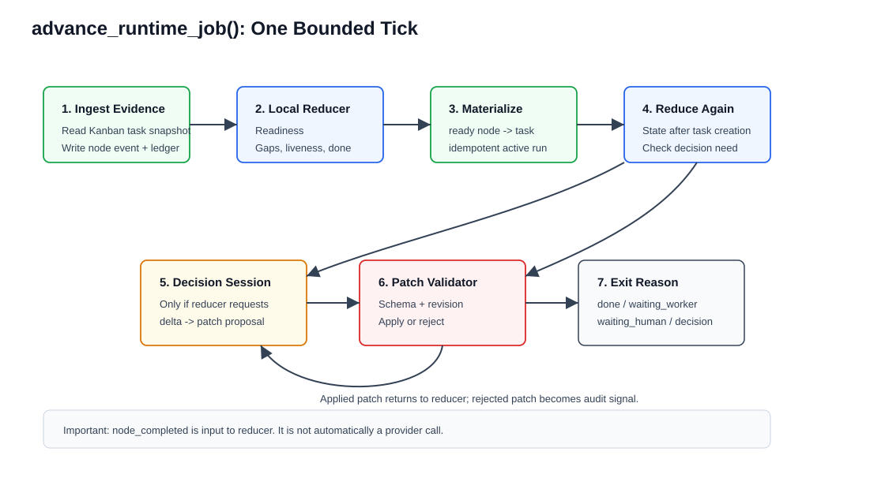
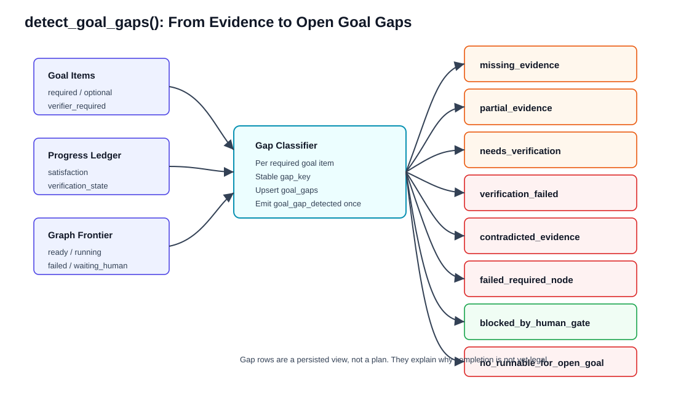
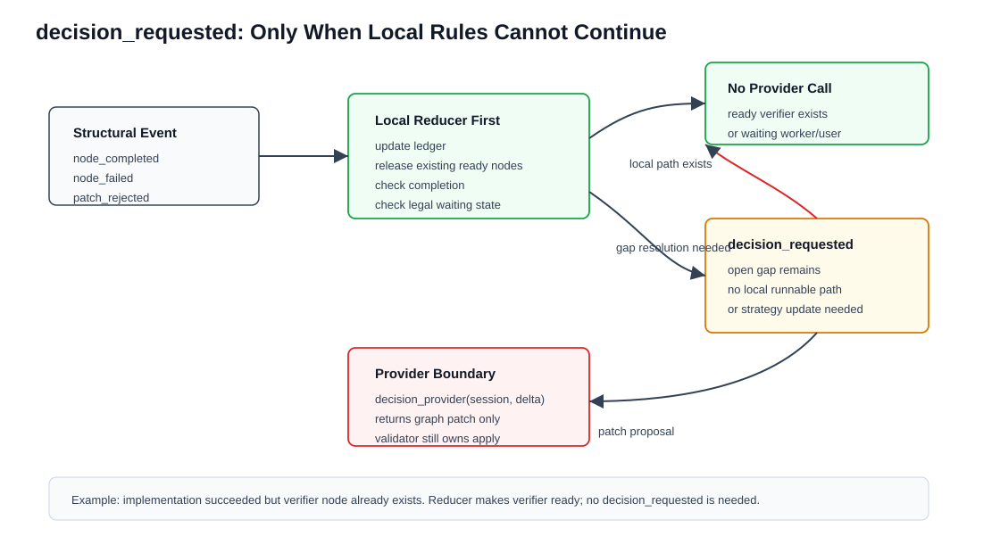
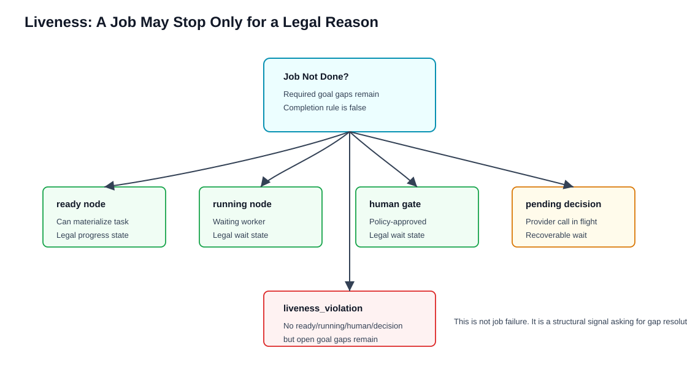
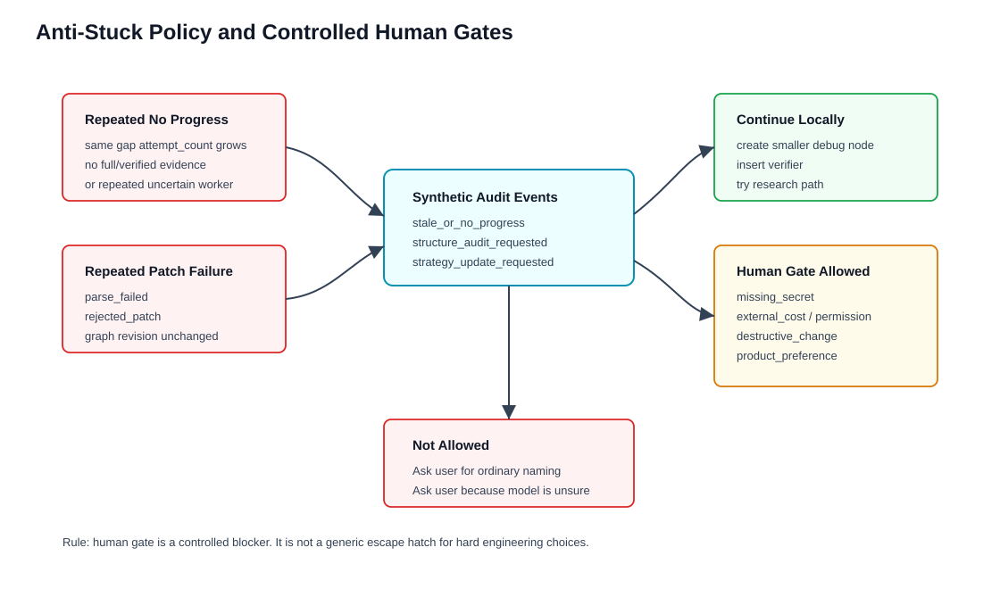

# Hermes Kanban Runtime Kernel 机制说明

本文档解释当前 `feature-kanban-runtime-kernel` 分支里已经落地的 runtime kernel 设计，重点说明 `goal gap detector`、`decision_requested`、`liveness_violation`、`progress ledger`、`anti-stuck` 和 `human gate` 等机制如何协同工作。

这不是旧 Orchestra 的 planner/coder/reviewer/tester 固定流程。当前实现的核心是：Kanban 负责 worker 生命周期和任务执行；runtime kernel 维护 DB 中的目标合同、目标证据账本、执行图和事件流；decision session 只作为非权威推理上下文；所有结构变化必须经过本地 validator。

## 总架构



当前系统可以理解成六个边界清晰的部分：

`User / Main Agent` 只负责创建 runtime job、读取状态、在必要时提供 human decision。它不能直接改 execution graph。

`Runtime Kernel` 是唯一的本地活逻辑，核心函数在 `hermes_cli/kanban_runtime_kernel.py`，包括 `advance_runtime_job()`、`reduce_runtime_job()`、`detect_goal_gaps()`、`materialize_runtime_node()` 和 `ingest_runtime_node_evidence()`。

`Authoritative DB State` 是事实源，保存 `goal_contracts`、`goal_items`、`progress_ledger`、`goal_gaps`、`execution_nodes`、`execution_events`、`graph_patches`、`kernel_decisions`、`decision_sessions` 和 `node_materializations`。

`Kanban Execution Layer` 只处理 task、run、dispatcher、worker lane、heartbeat、timeout、crash/retry 和 worker evidence。它不判断全局目标是否完成。

`Decision Session` 是非权威推理上下文。它可以保留 stable prefix、checkpoint 和 delta，帮助后续真实 LLM provider 延续项目理解，但它没有写权限。

`Patch Validator` 是结构修改边界。provider 只能返回 patch proposal；validator 检查 schema、`expected_revision`、op、goal linkage 和危险行为。`release_node`、直接 `complete_job`、无 goal/gap linkage 的 `create_node` 都不能通过。

## advance 循环



一次 `advance_runtime_job()` 是一个 bounded tick，不是一个持续思考 loop。

第一步，kernel 读取已经物化为 Kanban task 的 running node，通过 `task_progress_snapshot()` ingest worker evidence。worker 的结果会写回 node state、execution event、artifact 和 progress ledger。

第二步，kernel 调用 `reduce_runtime_job()`。这个 reducer 会本地计算 dependency readiness、goal gaps、liveness、job state 和 completion rule。

第三步，如果有 `ready` node 且允许创建 task，kernel 调用 `materialize_runtime_node()` 把 runtime node 变成 Kanban task。这个步骤是幂等的，同一个 active materialization 不会重复创建。

第四步，kernel 再跑一次 reducer。因为 materialization 会改变 node state 和 job state，例如 `ready` 变成 `running`，job 可能进入 `waiting_worker`。

第五步，只有当 reducer 判断当前结构需要新决策时，才会产生 `decision_requested`，并调用 decision provider。普通的 `node_completed` 本身不会直接触发 provider。

第六步，provider 返回 patch 后必须经过 `apply_graph_patch()` 和 `_validate_patch()`。patch 被接受才会改变 graph revision；parse failed 或 rejected patch 只会成为审计记录和事件。

## Goal Gap Detector



`goal gap detector` 的职责不是规划下一步，而是回答一个更底层的问题：为什么当前 job 还不能被本地 completion rule 判定为完成。

当前实现的入口是 `detect_goal_gaps(conn, job_id)`。它读取 required `goal_items`、对应的 `progress_ledger`、与 goal item 关联的 execution nodes，以及当前 graph frontier，然后为未满足目标生成稳定的 `goal_gaps`。

已经实现的 gap 类型包括：

- `missing_evidence`：required goal item 没有 usable ledger evidence。
- `partial_evidence`：有 evidence，但只是部分满足。
- `needs_verification`：有 full evidence，但 required verifier 还没给出 verified 证据。
- `verification_failed`：verifier 或 verification evidence 失败。
- `contradicted_evidence`：ledger 明确记录 contradicted evidence。
- `failed_required_node`：服务 required goal item 的节点失败，且没有替代路径。
- `blocked_by_human_gate`：目标推进正在等待合法 human gate。
- `no_runnable_for_open_goal`：还有 open goal gap，但没有 ready/running/waiting_human node。
- `stale_or_no_progress`：同一个 gap 多轮没有新进展。

例子：worker 完成了 provider 接口，但 evidence 只写了 `partial_goal_items=["data-provider"]`，没有通过 verifier。kernel 不会认为目标完成，而是写入 `partial_evidence` 或 `needs_verification` gap。

例子：verification node 失败，并返回 `verification={"passed": false}`。kernel 会生成 `verification_failed` gap，而不是把 job 标成 done，也不会把失败简单当成最终 blocked。

例子：某个 evidence 说明当前实现和目标冲突，并返回 `contradicted_goal_items=["runtime-result"]`。goal item 会进入 `contradicted`，completion rule 会拒绝完成，gap detector 生成 `contradicted_evidence`。

## Progress Ledger

`progress_ledger` 是 goal contract 和 execution graph 之间的证据账本。它不记录“做过哪些节点”这么粗的事实，而是记录“哪个 goal item 被什么 evidence 支持到什么程度”。

worker evidence 现在可以进入以下字段：

- `claimed_goal_items` 或 `claimed_goal_item_keys`
- `partial_goal_items` 或 `partial_goal_item_keys`
- `unmet_goal_items` 或 `unmet_goal_item_keys`
- `contradicted_goal_items` 或 `contradicted_goal_item_keys`
- `verification`
- `artifacts` 或 `artifact_refs`
- `remaining_gaps`
- `new_constraints`
- `active_assumptions`
- `rejected_approaches`
- `known_failure_boundaries`

这些字段会被 `update_progress_ledger()` 转成 ledger rows。每条 ledger row 至少包含 `satisfaction` 和 `verification_state`。`satisfaction` 表示目标满足程度，例如 `full`、`partial`、`none`、`contradicted`；`verification_state` 表示证据可信状态，例如 `verified`、`self_reported`、`unverified`、`failed`。

completion rule 的关键点是：node succeeded 不等于 goal item satisfied。只有 required goal items 在 ledger 里有足够 verified evidence，且没有 contradicted ledger、active human gate、running required node 或 failed required verifier，job 才能由本地规则进入 `done`。

## decision_requested



`decision_requested` 是 reducer 生成的结构性事件，表示“当前 DB 事实显示本地规则无法继续推进，需要 decision session 提出 graph patch proposal”。

它不是 worker event 的直接映射。以下事件只是 reducer 输入：

- `node_completed`
- `node_failed`
- `node_uncertain`
- `node_blocked`
- `patch_applied`
- `patch_rejected`
- `human_decision_received`

这些事件发生后，reducer 会先尝试本地处理：

- 如果依赖满足，直接把 waiting node 推到 `ready`。
- 如果 ready node 存在，等待 materialization。
- 如果 running node 存在，进入 `waiting_worker`。
- 如果合法 human gate 存在，进入 `waiting_human`。
- 如果 completion rule 满足，进入 `done`。

只有当 goal 仍未完成、open gaps 仍存在、且本地没有 ready/running/human/pending decision 的推进状态时，reducer 才会写入 `decision_requested`。

例子：implementation node succeeded 后，graph 里已经有 verifier node 依赖它。reducer 只需要把 verifier 推到 `ready`，不需要 provider。

例子：analysis node succeeded，但只声明 `unmet_goal_items=["initial-runtime-result"]`，graph 中没有后续 implementation node。reducer 会产生 gap，并写入 `decision_requested`。fixture provider 才会基于这个 gap 创建 implementation node。

## liveness_violation



`liveness_violation` 不是 job failure。它是一个结构性警报：目标没完成，但 runtime 没有任何合法可推进或可等待状态。

当前 liveness 判断可以这样理解：

如果 job 未 done，且还有 open goal gaps，同时没有：

- ready node
- running node
- active human gate
- pending decision
- 合法 blocked state

那么 runtime 不能静默 idle。它必须记录 `liveness_violation`，并让下一轮 advance 进入 gap resolution。

例子：root analysis node 被标成 failed，目标仍缺 evidence，graph 中没有任何 ready/running node。这时 gap detector 会生成 `failed_required_node` 和 `no_runnable_for_open_goal`，reducer 会写入 `decision_requested` 和 `liveness_violation`。

例子：存在合法 human gate，比如需要用户提供 API key。这时没有 ready/running node 也不是 liveness violation，因为 `waiting_human` 是合法等待状态。

## Anti-Stuck 和 Human Gate



Phase 2C 已经有最小 anti-stuck 机制。它的目标不是自动解决所有复杂任务，而是避免 runtime 在同一种失败模式里重复推进却没有任何新证据。

当前已经实现的信号包括：

- 同一个 open gap 多轮反复出现，会生成 `stale_or_no_progress` gap。
- 连续 patch rejected 且没有 applied graph change，会生成 `structure_audit_requested`。

这些 synthetic events 不会直接让模型控制状态。它们只是告诉后续 decision provider：继续相同路线没有意义，需要换策略，例如拆小 debug node、创建 research node、插入 verifier、supersede 失败节点，或在确实需要用户授权时创建 human gate。

human gate 是受控阻塞，不是通用逃生出口。当前 validator 要求 `request_human` 带合法的 `decision_type`，并且必须有 `node_key`、`question`、`why_user_required` 和 `default_recommendation`。

允许进入 human gate 的典型原因包括：

- `missing_secret` 或 `credential`
- `external_cost`
- `permission_required`
- `destructive_change`
- `product_preference`
- `architecture_choice`
- `legal_or_policy`

不应该因为普通工程细节询问用户，例如内部函数命名、目录组织、是否先 mock 后真实接入、局部 debug 路线。这些应由 runtime 按 defaults policy 推进并记录 rationale。

## 完整例子一：从缺证据到 implementation node

用户目标是“实现一个最小 runtime 闭环”。创建 job 后，系统生成 required goal item：`initial-runtime-result`，并创建初始 `understand-scope` node。

`understand-scope` 被物化成 Kanban task。worker 完成后返回：

```json
{
  "verdict": "succeeded",
  "summary": "analysis found implementation gap",
  "unmet_goal_items": ["initial-runtime-result"],
  "verification": {"passed": false}
}
```

kernel ingest 后不会把 job 完成。progress ledger 写入 `none/unverified`，gap detector 生成 `missing_evidence`。因为没有后续 ready/running node，reducer 写入 `decision_requested`。fixture provider 基于 delta 返回 patch，创建 `implement-initial-runtime-result` node。

## 完整例子二：实现完成但还不能 done

implementation node 完成后返回：

```json
{
  "verdict": "succeeded",
  "summary": "implementation produced self-reported evidence",
  "claimed_goal_items": ["initial-runtime-result"],
  "verification": {"passed": false}
}
```

ledger 会记录 `full/self_reported`。因为 goal item 要求 verifier，goal item 只能处于 partial，gap detector 生成 `needs_verification`。如果当前 graph 中没有 verifier，reducer 会请求 decision；fixture provider 会插入 verifier node。

只有 verifier node 返回 `verification={"passed": true}` 并产生 `full/verified` ledger evidence 后，required goal item 才能进入 `satisfied`，job 才能由本地 completion rule 进入 `done`。

## 完整例子三：失败不是停止，而是 gap resolution

如果 verifier failed，worker evidence 可能是：

```json
{
  "verdict": "failed",
  "summary": "verification failed",
  "claimed_goal_items": ["initial-runtime-result"],
  "verification": {"passed": false, "summary": "pytest failed"}
}
```

kernel 会把 verifier node 标成 failed，并把 ledger 写成 failed verification。gap detector 生成 `verification_failed`，completion rule 拒绝完成。后续 decision provider 可以提出 debug node、split node、research node 或合法 human gate，但不能直接把 job complete，也不能用 `release_node` 绕过本地 readiness。

## 当前实现位置

核心实现集中在：

- `hermes_cli/kanban_runtime_kernel.py`
- `hermes_cli/kanban_runtime_decision.py`
- `hermes_cli/kanban.py`

关键函数：

- `advance_runtime_job()`
- `advance_runtime_job_until_idle()`
- `reduce_runtime_job()`
- `detect_goal_gaps()`
- `detect_stagnation()`
- `summarize_active_frontier()`
- `summarize_liveness()`
- `summarize_progress_ledger()`
- `update_progress_ledger()`
- `apply_graph_patch()`

关键测试：

- `tests/hermes_cli/test_kanban_runtime_kernel.py`
- `tests/hermes_cli/test_kanban_runtime_decision.py`
- `tests/hermes_cli/test_kanban_cli.py`

当前这套机制的边界是清楚的：runtime kernel 负责目标推进语义，decision provider 只负责提出结构变化建议，Kanban 只负责执行生命周期。后续接真实 LLM provider 时，模型看到的是 goal gaps、frontier、ledger 和 delta，而不是被要求在长 prompt 里自己发明 completion、liveness 或 blocked 规则。
